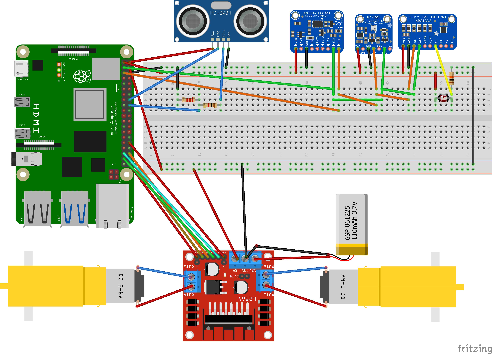

# Car Logic
A python module, designed for the raspberry pi 4b, that controls all the logic to read sensor data, control motors, follow and send instructions by various protocols, mainly MQTT. 

All drivers for sensors, where coded from scratch no external dependencies where used. 

## Code Requirements 
To execute any of the code in the subfolders, ensure you are running on a python virtual environment (venv). If no, create one and use it from the termimal: 
```bash
python3 -m venv rasp-car
source rasp-car/bin/activate
```

If you need to get out of the venv, just use __deactivate__
```bash
deactivate
```

Ensuring you are in a venv, install the requirements using: 
```bash
pip3 install -r requirements.txt
```

Now you can run any part of the code, ensure you read the documentation provided in every part and in the code.

## How to wire it up

To see specifics of each part, refer to [**sensor**](./sensors/README.md#how-to-wire-it-up) and for motor refer to [**motors**](./motors/README.md#how-to-wire-it-up).


## Run 

To test the controllers, sensors and the connections, use the test.py file, it is part of the module car_logic if you are running it from the parent folder:

```bash
python -m car_logic.test [params]
```
If you are running it from car_logic folder user: 
```bash
python -m test [params]
```
### Params

## File Descriptions

### Connections

This folder contains the files used to communicate between the different sensors via HTTP requests. Each sensor is mapped to an endpoint with API urls.

### Motors

The motors folder provides functionality to control motor movements using a Raspberry Pi and a motor driver. It includes code to initialize and manage motor directions (forward, backward, left, right, and spins) through GPIO pins, along with a test script to verify motor operations.

### Sensors
  
This folder provides setup instructions and code for controlling motor movements and connecting sensors to a Raspberry Pi. It includes necessary library installations, wiring guidance, and a class to manage motor actions. Testing scripts are also provided to verify the setup and functionality.

### setGPIO.py

This script provides utility functions for configuring and controlling GPIO pins on a Raspberry Pi. It includes functions to configure specific pins as outputs, and set output states for those pins. These functions are designed to handle errors and offer optional print feedback to indicate the status of operations.

### setupControllers.py

This script provides a function to initialize and configure multiple controllers, including motor, sensor, API, MQTT, and database controllers. It retrieves configuration data from an API endpoint and uses optional parameters to override defaults for MQTT and database settings. If the API lacks necessary configurations, it raises an error. This setup ensures all controllers are ready for coordinated operation in a connected environment.

### test.py

This script provides a command-line interface to control motors, read sensor data, and manage data transmission through API, MQTT, and database connections. It initializes controllers for each component, enabling flexible interaction with motors and sensors and configurable data handling options.

