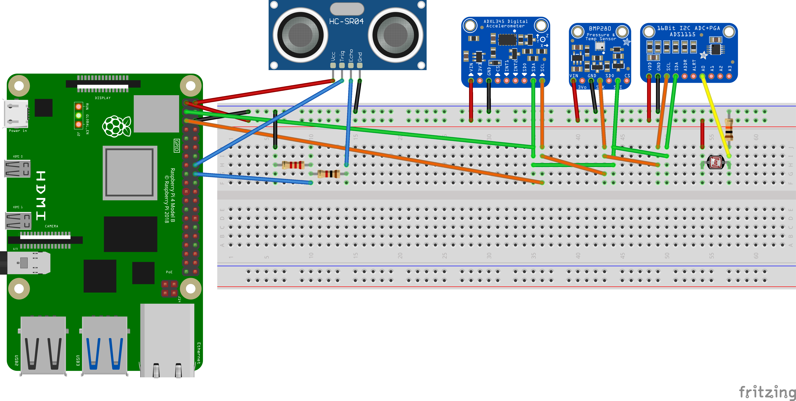

# Description

## SETUP 

There is a a Driver for each sensor, each driver is written in a minimal way just to be able to read the requiered data used in the project, below is listed the sensor and the corresponding driver for each sensor. 

|Sensor|Used Driver|
|---|---|
|BME/BMP-280 | bmp280.py |
|ADS - 1115 | ads1115.py |
|ADXL - 345 | adxl345.py |
|Ultrasonic | ultrasonic.py|
| ||

### sense.py
This file contains a [class](#sensorcontroller) designed to manage each sensor. The class provides methods to initialize these sensors, read data from each sensor, and combine the readings into a single dictionary. It also ensures proper cleanup of resources when the object is destroyed.
- To manage each sensor, uses the drivers listed on the table. 

* All of the packages are listed in the parent folder under requierements.txt

## How to wire it up 

This is an example view, you don't need to stricly reproduce it this way. You can use the pins as you wish. The showed layout is already declared as default.

- All SDA -> 3 (SDA)
- All SCL -> 5 (SCL)
- ULtrasonic Trig ->  16 (GPIO23)
- Voltage Divider -> 18 (GPIO24)

[!NOTE] Ultrasonic Sensor should be connected to 5v and the rest of the sensors should be connected to 3.3v

## Usage
### SensorController

The class **`SensorController`**, found in [**sense.py**](./sense.py),provides methods for interacting with various sensors, as listed below:

- **`readLightSensor()`**: Reads data from the light sensor (ADS1115).
- **`readAccelerometer()`**: Reads data from the accelerometer (ADXL345), including x, y, z axis acceleration and events.
- **`readEnvironmentSensor()`**: Reads data from the environmental sensor (BMP280), including temperature, pressure, and altitude.
- **`readDistanceSensor()`**: Reads data from the Ultrasonic distance sensor.
- **`readAllSensors()`**: Reads data from all sensors and combines it into a single dictionary.

Below is a sample implementation of this controller

```python
sense = SensorController()
print(sense.readAllSensors())
```
This will print all sensor data. 

## Testing 
Follow any previous setup and run the _test.py_ script

```bash
python -m test
```
Alternatively you can run the test from parent directory by: 
```bash
python -m sensors.test
```
Or from outside the car_logic module:
```bash
python -m car_logic.sensors.test
```